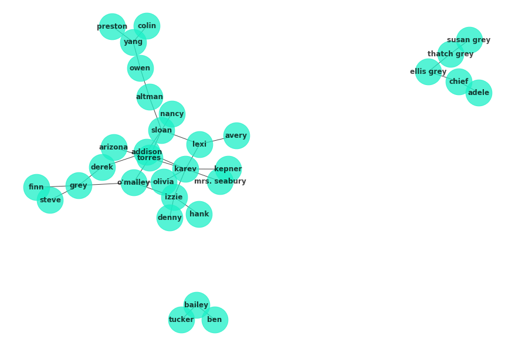
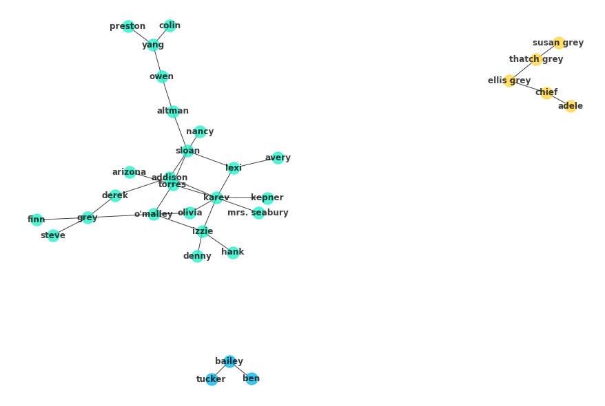

# Clustering Networks

## Introduction

You've now looked at some basic measures of nodes and their relationships to one another. Expanding upon this analysis of networks, it is natural to focus on larger structures within the network. In this lesson you'll explore clusters within networks such as subcultures, social circles and cliques. 

## Objectives

You will be able to:

* Discuss various approaches to clustering networks
* Implement clustering via NetworkX
* Define clique
* Define Bipartite

## Approaches to Clustering

You've already started to get a vague sense of clustering: in the previous lab, you attempted to find individuals who bridged two different social circles within a larger network. These key individuals whom connect the network are then the glue that holds the network together. From this, there are two ways to approach clustering groups and subgroups in networks: one is from the bottom up, building smaller networks from central nodes on out, and the other from the top down, removing central nodes from the full network and observing how the network splinters into factions.  

One method exhibiting the former approach to clustering is k-clique clustering. A clique is a subset of nodes which are adjacent to all the other nodes within the clique. The most simple example is with three nodes:


The Girvan–Newman algorithm takes the opposite approach. It starts with the full network and then begins removing nodes with the largest betweeness, observing how the graph then breaks into smaller clusters.

## Implementing Clustering with NetworkX


## K-Clique Clustering in NetworkX


```python
import networkx as nx
import matplotlib.pyplot as plt
%matplotlib inline
G = nx.read_gexf('ga_graph.gexf')
plt.figure(figsize=(12,8))
nx.draw(G, with_labels=True, node_color="#1cf0c7",
        alpha=.75, font_weight="bold", node_size=2*10**3, pos=nx.spring_layout(G, seed=4))
```





```python
c = list(nx.algorithms.community.k_clique_communities(G, k=2))
c
```


    [frozenset({'addison',
                'altman',
                'arizona',
                'avery',
                'colin',
                'denny',
                'derek',
                'finn',
                'grey',
                'hank',
                'izzie',
                'karev',
                'kepner',
                'lexi',
                'mrs. seabury',
                'nancy',
                "o'malley",
                'olivia',
                'owen',
                'preston',
                'sloan',
                'steve',
                'torres',
                'yang'}),
     frozenset({'adele', 'chief', 'ellis grey', 'susan grey', 'thatch grey'}),
     frozenset({'bailey', 'ben', 'tucker'})]


```python
colors = [("teal","#1cf0c7"),
         ( "workzone_yellow","#ffd43d"),
         ("light-blue","#00b3e6"),
         ("medium-blue","#32cefe"),
         ("gray","#efefef"),
         ("slate","#2b2b2b")]
color_dict = dict(colors)
```


```python
fig = plt.figure(figsize=(12,8))
for n, ci in enumerate(c):
    ci = G.subgraph(ci)
    nx.draw(ci, with_labels=True, node_color=colors[n][1],
            alpha=.75, font_weight="bold", pos=nx.spring_layout(G, seed=4))
```





## The Girvan Newman Algorithm in NetworkX


```python

```

## Summary

In this lesson, you explored two algorithmic approaches to clustering networks. Such methods are essential for dissecting large networks into small constituencies for deeper analysis and comparison. From here, you'll further practice clustering with an applied analysis to a social network.
